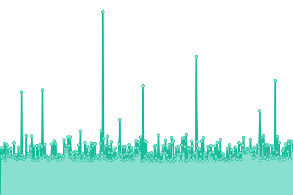
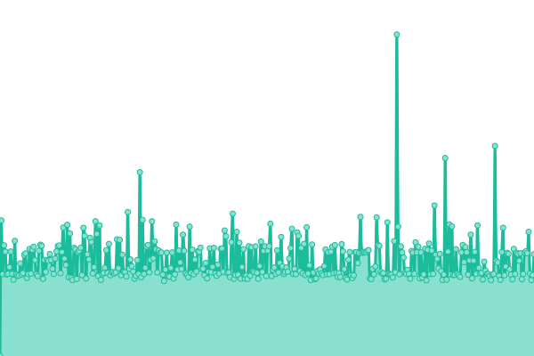

# [📈 Live Status](https://status-drones.YOURDOMAIN.com): <!--live status--> **🟧 Partial outage**

This repository contains the open-source uptime monitor and status page for [Ahmed-Abdelkhalek](https://status-drones.YOURDOMAIN.com), powered by [Upptime](https://github.com/upptime/upptime).

With [Upptime](https://upptime.js.org), you can get your own unlimited and free uptime monitor and status page, powered entirely by a GitHub repository. We use [Issues](https://github.com/ahmedabdelkhalek1/drones-status/issues) as incident reports, [Actions](https://github.com/ahmedabdelkhalek1/drones-status/actions) as uptime monitors, and [Pages](https://status-drones.YOURDOMAIN.com) for the status page.

<!--start: status pages-->
<!-- This summary is generated by Upptime (https://github.com/upptime/upptime) -->
<!-- Do not edit this manually, your changes will be overwritten -->
<!-- prettier-ignore -->
| URL | Status | History | Response Time | Uptime |
| --- | ------ | ------- | ------------- | ------ |
|  [GCAA Drones Portal](https://drones.gov.ae/) | 🟩 Up | [gcaa-drones-portal.yml](https://github.com/ahmedabdelkhalek1/drones-status/commits/HEAD/history/gcaa-drones-portal.yml) | 

 1772ms
     
 | 

<a href="https://ahmedabdelkhalek1.github.io/drones-status/history/gcaa-drones-portal">100.00%</a>
    

|  [GCAA Grafana](https://api.drones.gov.ae/grafana/login) | 🟩 Up | [gcaa-grafana.yml](https://github.com/ahmedabdelkhalek1/drones-status/commits/HEAD/history/gcaa-grafana.yml) | 

 1455ms
     
 | 

<a href="https://ahmedabdelkhalek1.github.io/drones-status/history/gcaa-grafana">99.77%</a>
    

|  [Ahmed](https://api.ahmed.ah/) | 🟥 Down | [ahmed.yml](https://github.com/ahmedabdelkhalek1/drones-status/commits/HEAD/history/ahmed.yml) | 

 0ms
     
 | 

<a href="https://ahmedabdelkhalek1.github.io/drones-status/history/ahmed">0.00%</a>
    

<!--end: status pages-->

[**Visit our status website →**](https://status-drones.YOURDOMAIN.com)

## 📄 License

- Powered by: [Upptime](https://github.com/upptime/upptime)
- Code: [MIT](./LICENSE) © [Anand Chowdhary](https://anandchowdhary.com), supported by [Pabio](https://pabio.com)
- Data in the `./history` directory: [Open Database License](https://opendatacommons.org/licenses/odbl/1-0/)
